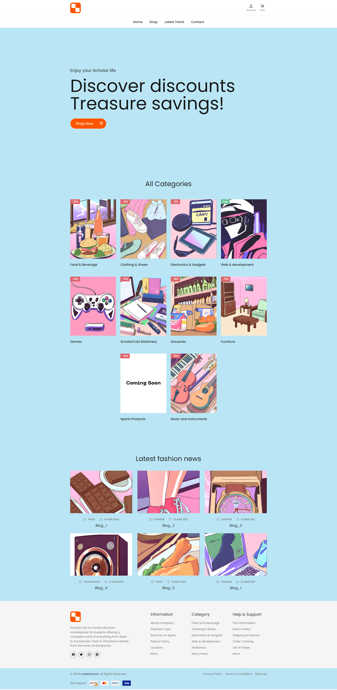
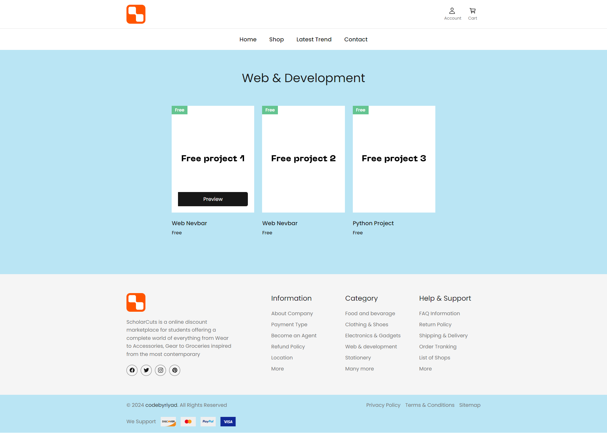
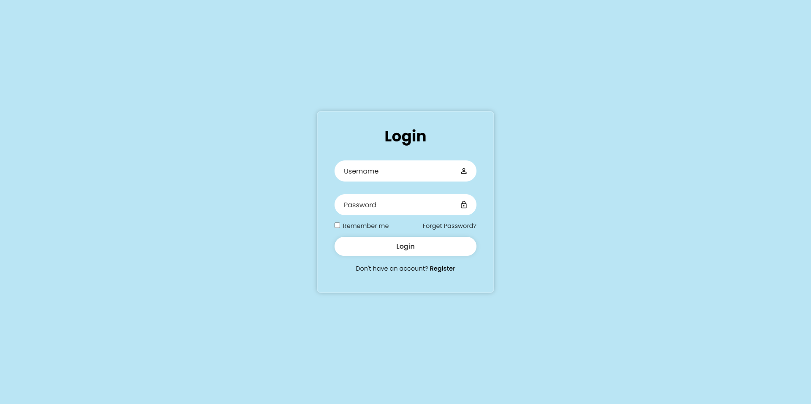
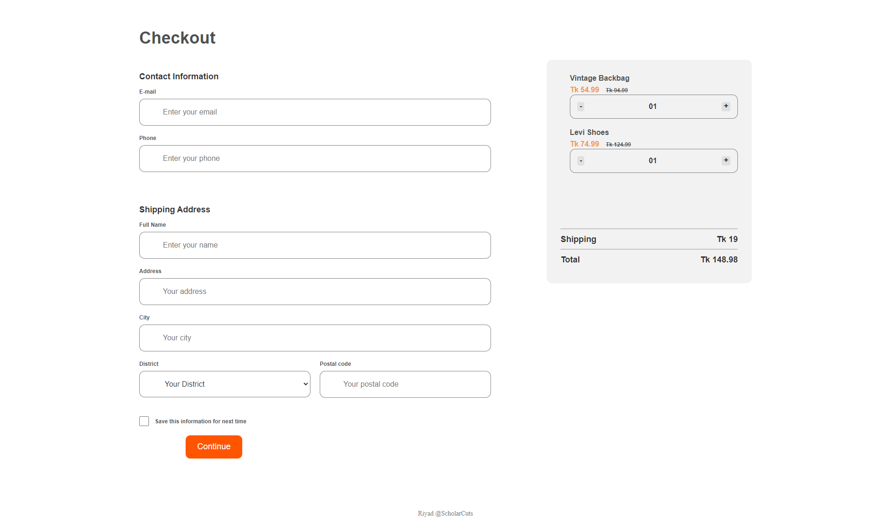
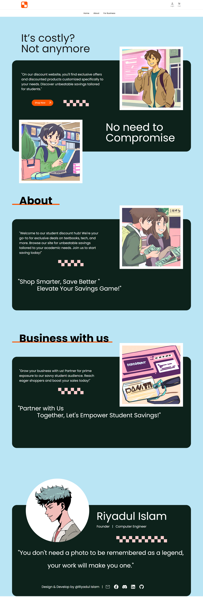

<h1 align="center">ScholarCuts</h1>
<h2>ScholarCuts is a responsive E-commerce website that is built with HTML, CSS, and JavaScript.</h1>

## Table of Contents

- [About](#about)
- [How to Run](#how-to-run)
- [Screenshots](#screenshots)
  - [Landing page](#landing-page)
  - [Categories](#categories)
  - [Login page](#login-page)
  - [Checkout page](#checkout-page)
  - [Company page](#company-page)
- [Contact](#contact)

## About
- It is a small project built in HTML, CSS, and JavaScript. I named it "ScholarCuts".
- To see the website follow the [website](https://scholarcuts.netlify.app)

## How to Run
  - Install any IDE in your system that supports HTML, CSS, and JavaScript. Or you can use VS Code.
    - To install VS Code, follow the [VS Code Page](https://code.visualstudio.com/download).
  - Clone the project from my repository.
    - For the Cloning repository, follow the [GitHub Page](https://docs.github.com/en/repositories/creating-and-managing-repositories/cloning-a-repository)
  - Run the project on the live server and enjoy.

## Screenshots
  ### Landing page

  ### Categories

  ### Login page

  ### Checkout page

  ### Company page

## Get Help From
- HTML, CSS, and JavaScript documentation
- Stack overflow
- ChatGPT

## Contact
GitHub [@riyad959](https://github.com/riyad959)

 

